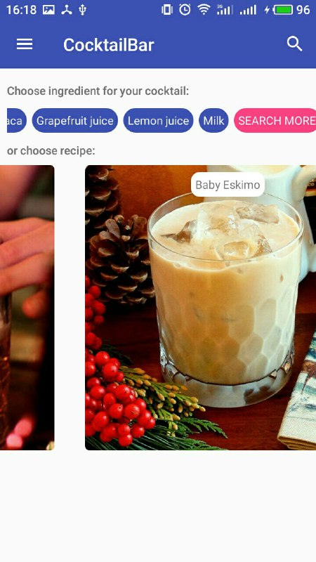
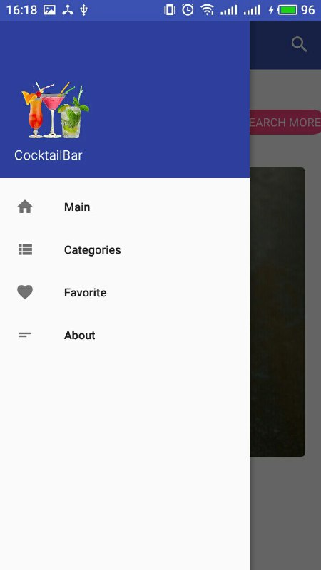
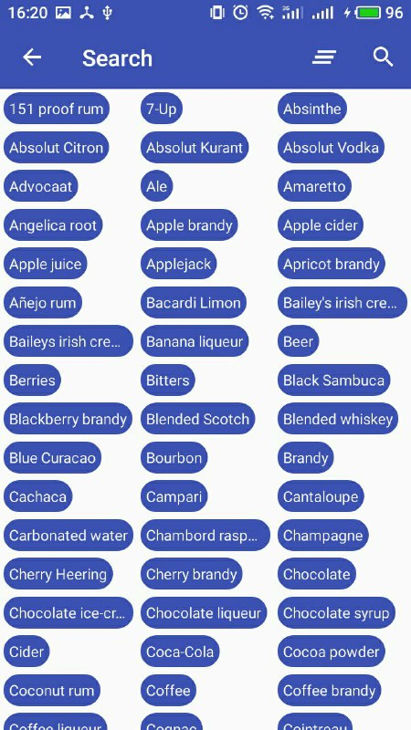
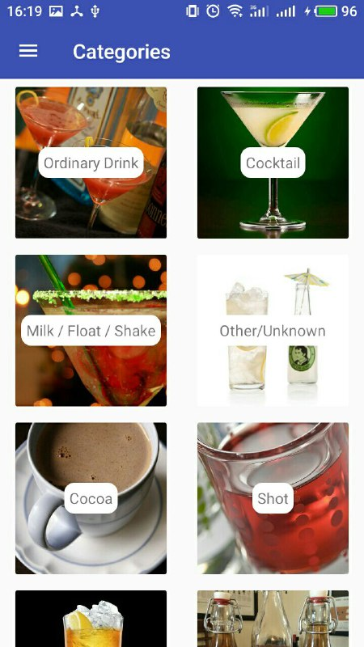
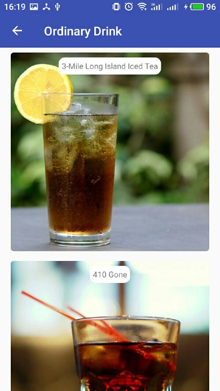
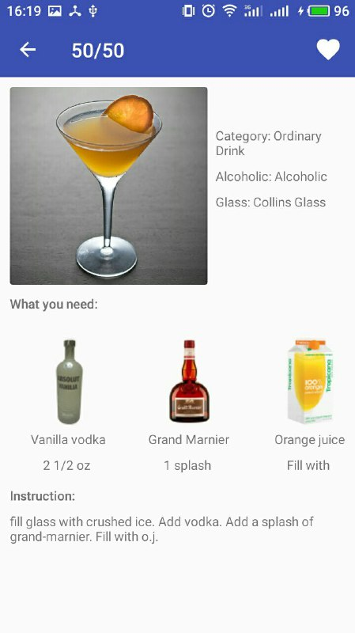

# CocktailBar
App for search cocktail recipes that helps you find the cocktail by name, ingredients, categories, and strength of the drink.

 [CocktailBar info](https://docs.google.com/document/d/15A-MlNlAgQv6tyvChwAs0fHJObsz1eCB31eNCCzGgQI/edit?usp=sharing)

## Screenshots:
Main screen | Navigation view | Ingredients 
-------------|----------------- | -------------
 |  |  

Categories | Category | Drink
-------------|----------------- | -------------
 |  | 

## License
This application is Free Software ([GNU General Public License](https://www.gnu.org/licenses/gpl.html)).
